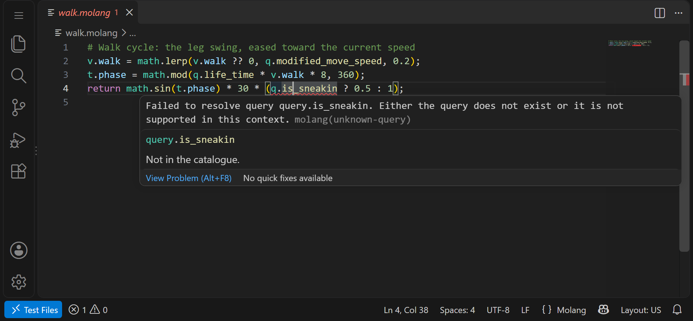
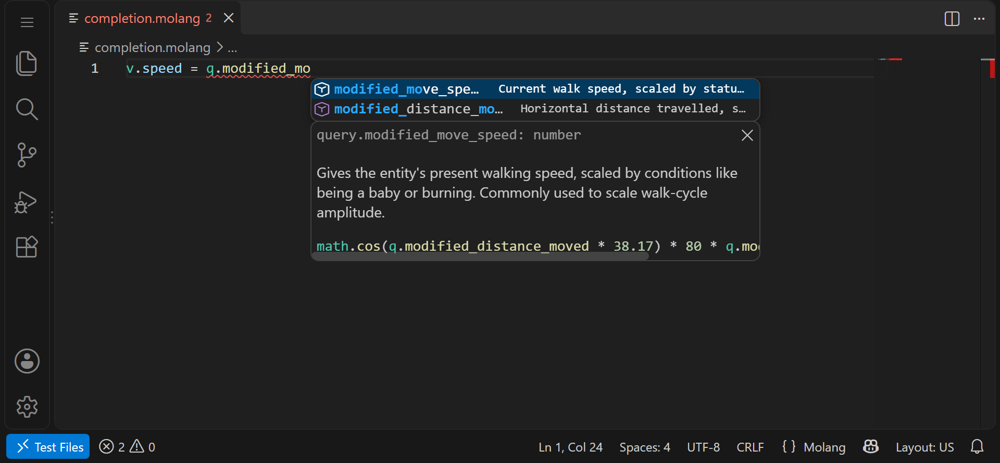
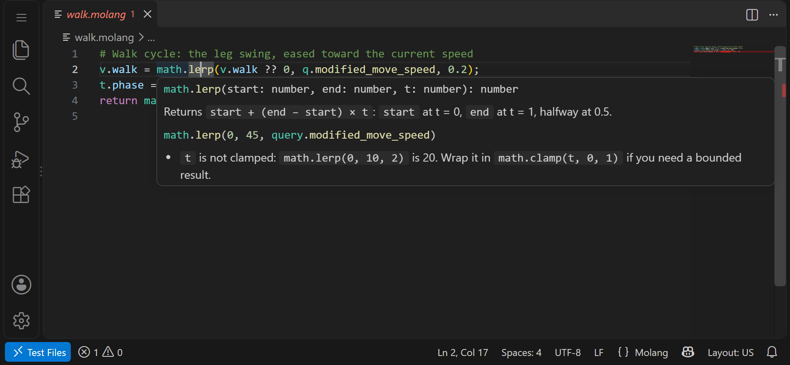
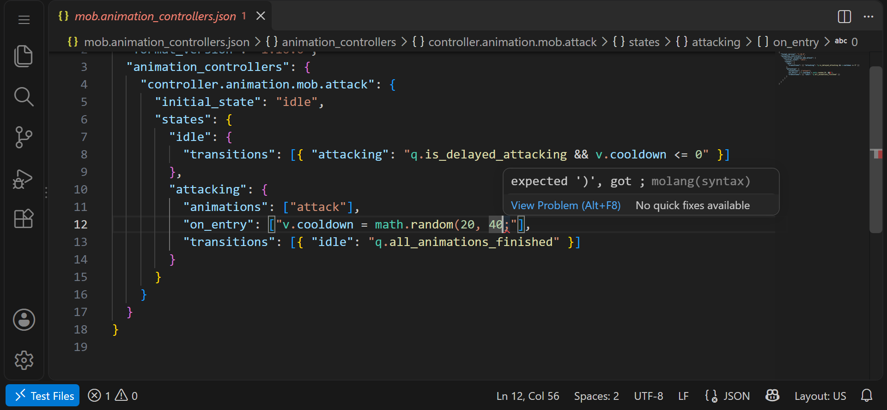

# Molang

Molang support for Minecraft Bedrock add-on creators: the mistakes the game
would refuse, shown as you type, with completion and documentation for every
query and math function. It works in `.molang` files and in the Molang inside
your pack's JSON (animation controllers, client entities, render controllers,
particles, entities, features and more), on the desktop and on vscode.dev.



## What it does

**Errors in the game's own words.** Every syntax error in an expression, not
only the first; unknown queries and math functions; the wrong number of
arguments; deprecated queries; and what a field does not allow, such as a
query that only works in world generation used in an entity, or an
assignment in a block condition. The messages are the ones the content log
would print, so a search for one finds the same thing you would see in game.

**Quick fixes**: a deprecated query's replacement; for a query that does not
resolve, the nearest names the field can use; `a.` to `array.`, `m.` to
`math.` and other namespace slips; a missing final `;`.

**Completion** of namespaces, queries and math functions with their
signatures and documentation, the variables and temps the file already uses,
and what can follow `->`.



**Hover** for queries and math functions, and for variables: where the file
writes them and reads them -- in JSON, in which fields. **Signature help**
inside calls.



**Go to definition, find references and rename** for `variable.*` and
`temp.*`. In JSON a variable is one symbol across the file's fields (set in
`scripts/initialize`, read in `scripts/animate`); a temp belongs to its one
expression; `q.parent->v.x` is another entity's and is left alone.

**Molang in JSON.** Strings in pack JSON are recognised by where they are,
the way the game reads them: which queries a field can use and which
operations it allows. Escapes such as `\"` are handled, so an error points at
the right character.



**Formatting** of `.molang` files, whole or a selection: a statement per
line, blocks indented, long conditionals and chains of operators broken
over lines, comments and blank lines kept. In pack JSON, **Format Molang in
this string** and **Minify Molang in this string** are code actions on a
Molang string, which stays on one line.

Also: semantic highlighting, a grammar for `.molang` files, a **Molang:
Minify** command, an outline of the variables a file uses, parameter names
as inlay hints in query and math calls (off by default,
`molang.inlayHints.parameterNames`), and **Molang: Show Molang regions in
this file**, which outlines and lists where the extension reads Molang in
the open file and what found each string.

### Files it reads

- `.molang` files.
- Resource pack JSON: animation controllers, animations, render
  controllers, client entities, attachables, particles, geometry and entity
  sounds.
- Behavior pack JSON: entities, blocks, items, biomes, feature rules,
  features and processor lists.

JSON files are recognised by their root key (`animation_controllers`,
`minecraft:client_entity`, ...), whatever folder they are in.

### Molang the schemas mark

The JSON schemas VS Code applies to a file are read too: those other
extensions contribute (Blockception's, for one), those in the `json.schemas`
setting, and the file's own `$schema`, matched to the file by VS Code's own
rules. Wherever a schema marks a string as Molang -- `"format": "molang"`, a
title starting "Molang", a reference to Mojang's `Expression Node.json` or
`Molang string.json`, the `{"expression", "version"}` object form -- and the
shipped path catalogue has no entry for it, the string is read as Molang as
well. The catalogue always wins: a field it knows is read as the kind it
gives, and a field it has removed or declared not Molang stays that way. A
schema cannot say which kind of Molang a field holds, so these are read as
general Molang (world generation Molang in feature, feature rule and biome
files).

This never delays diagnostics: a file is checked against the catalogue as
it opens, and again if its schemas add anything. Schemas are read once and
kept; a remote one is fetched with a short timeout, not at all when
`json.schemaDownload.enable` is off. `molang.json.schemaDetection` turns the
whole thing off, and **Molang: Show Molang regions in this file** shows
which strings came from the catalogue and which from a schema.

### Versions

Some queries exist only in files read at certain versions: added in one,
removed in a later one. A pack JSON file's Molang is taken to be read at the
file's `format_version`, and a query outside its versions is reported as
not resolving. This is a best-effort rule, applied to behaviour-pack files
(entities, blocks, items, features, feature rules, biomes) and resource-pack
client files (client entities, attachables, animations, animation
controllers, render controllers, particles) alike. Geometry is the exception:
its `format_version` is the geometry format's own. A file without a
`format_version`, and every `.molang` file, is read at no version, so no
query is refused for its version. `molang.versionSource` set to `ignore`
turns the version checks off.

## `.molang` files

Molang has no comments, so the convention the community's tools share
applies: `#` starts a comment to the end of the line. `#{ ... }` is a jsonte
template, not a comment; it is left for jsonte.

jsonte removes only comments that start with `# `, a hash and a space; a
`#note` would reach the game, so it is a warning with a fix. A file saved with
a byte order mark is a warning too: jsonte copies the mark into the JSON it
builds, and the game refuses the expression it starts.

Formatting keeps both. A comment stays with the statement it was written
against: on its own line before it, at the end of its line, or before a
block's closing brace. One written inside a statement, between the arms of a
conditional say, is moved to before that statement, since the formatter
chooses where a statement breaks. Templates are kept exactly as written; one
that stands where neither a value nor a name could leaves the file
unformatted. Minifying keeps templates but refuses a file with comments, as a
single line has nowhere to put them.

## With Blockception's extension

[Blockception's Minecraft Bedrock Development extension](https://marketplace.visualstudio.com/items?itemName=BlockceptionLtd.blockceptionvscodeminecraftbedrockdevelopmentextension)
covers far more of an add-on than Molang, and it has Molang support of its
own. The two can be installed together, and this extension is built for
that:

- Diagnostics and hovers from both are shown, so a Molang error in pack
  JSON shows twice. **Molang: Let Molang handle Molang diagnostics** (offered
  the first time it happens, and as a quick fix) adds Blockception's own
  `diagnostic.disable.<code>=true` lines for its Molang diagnostics to the
  project's `.mcattributes`: an ordinary edit, which undo takes back. Its
  other diagnostics, and the Molang lints this extension has no equivalent
  of, stay.
- Highlighting cannot be shared, so in JSON this extension leaves it to
  Blockception while Blockception is installed
  (`molang.json.semanticTokens`).
- Completion in JSON is left to Blockception while its own JSON completion is
  on, so the list is not doubled (`molang.json.completion`).
- `.molang` files that Blockception claims get this extension's features too.

What this extension adds alongside it is the checking: an expression is read
by the same rules the game loads it with, and what it reports is what the
game would refuse.

## In the browser

On [vscode.dev](https://vscode.dev) and github.dev everything works as on
the desktop, except `molang.catalogue.path`: a web extension cannot read a
file by path, so the shipped catalogue is always used there. Schemas are
read there too, through the editor's file system; a remote schema is
fetched by the browser, so one whose server does not allow it (CORS) is
skipped, as an unreachable one is on the desktop.

## Settings

| Setting | |
| --- | --- |
| `molang.catalogue.path` | A `catalogue.json` to use instead of the shipped one. |
| `molang.diagnostics.unknownQueries` | Severity for a query that does not resolve; `default` is an error, as the game refuses the expression. |
| `molang.versionSource` | `format_version` (the default) reads a pack file's Molang at its `format_version`; `ignore` skips the version checks. |
| `molang.format.indentSize` | Spaces per level when formatting; unset follows the editor. |
| `molang.format.lineWidth` | The line width formatting keeps to where it can (100). |
| `molang.json.enabled` | Molang features inside JSON files. |
| `molang.json.schemaDetection` | Also read the Molang JSON schemas mark. |
| `molang.json.completion` | `auto`, `on` or `off`. |
| `molang.json.semanticTokens` | `auto`, `on` or `off`. |
| `molang.inlayHints.parameterNames` | Parameter names before call arguments. |

## How it works

The analysis is [molang-go](https://github.com/stirante/molang-go), a Molang
implementation in Go, compiled to WebAssembly and run inside the extension:
nothing is sent anywhere, and there is nothing else to install. The query
catalogue ships with the extension and names the game version it describes.

Found an expression the game accepts and this extension refuses, or the
other way round? That is a bug; please
[open an issue](https://github.com/stirante/molang-go/issues) with the
expression and where it was written.

## License

MIT; see [LICENSE](LICENSE). Not affiliated with Mojang or Microsoft.

## Building

From `apps/vscode`, with Go and Node installed:

```
npm install
npm run build        # the WebAssembly module and the bundles
npm test             # unit tests, over the real module
npm run test:integration   # in a downloaded VS Code; opens a window
npm run test:web     # the web build in VS Code for the Web, headless Chromium
npm run package      # molang.vsix
```

`node scripts/make-icon.mjs` redraws the icon and `node scripts/screenshots.mjs`
retakes the pictures above, from the built extension.
